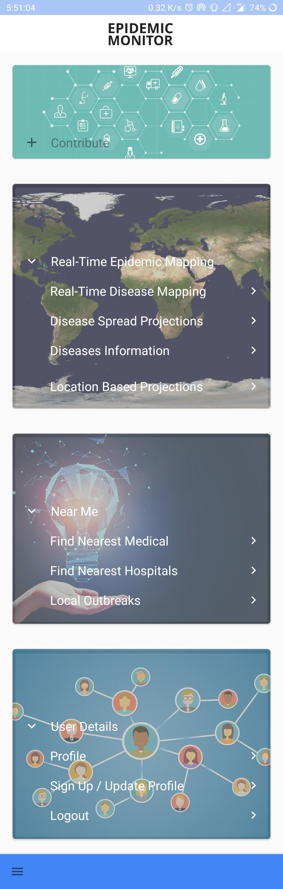
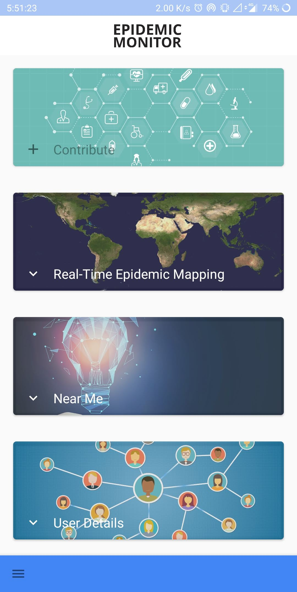
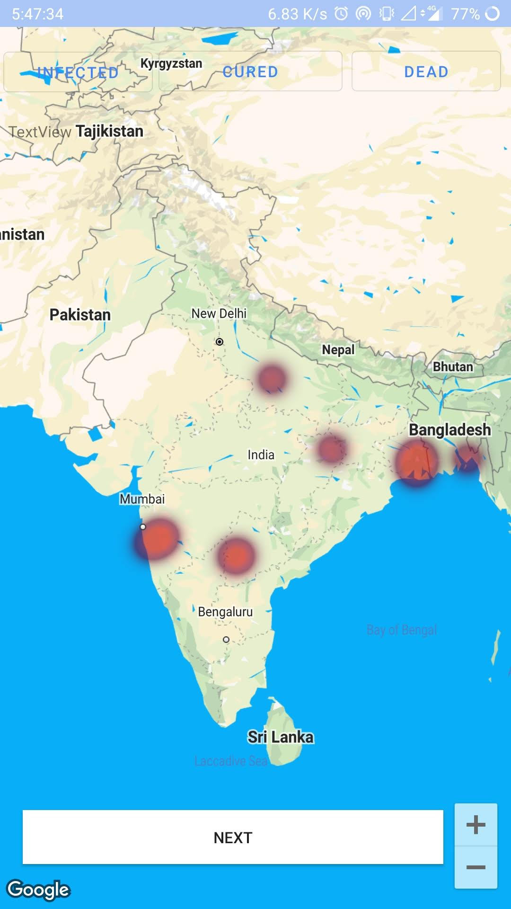
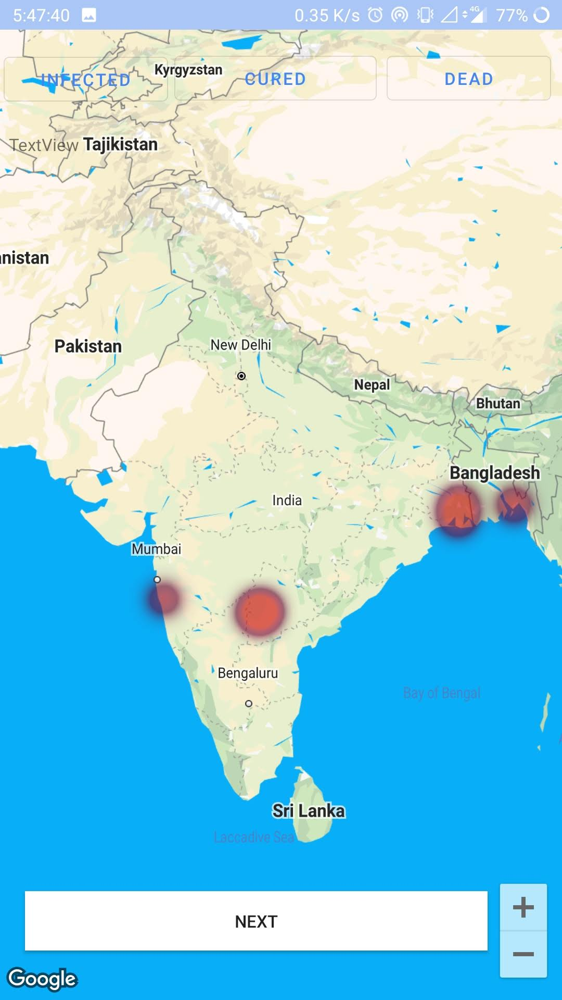
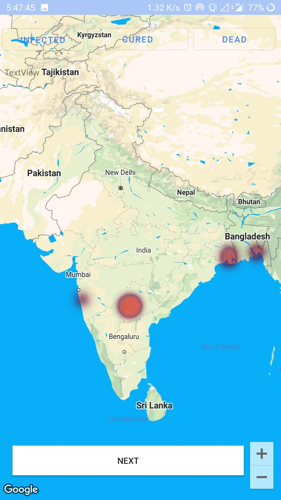
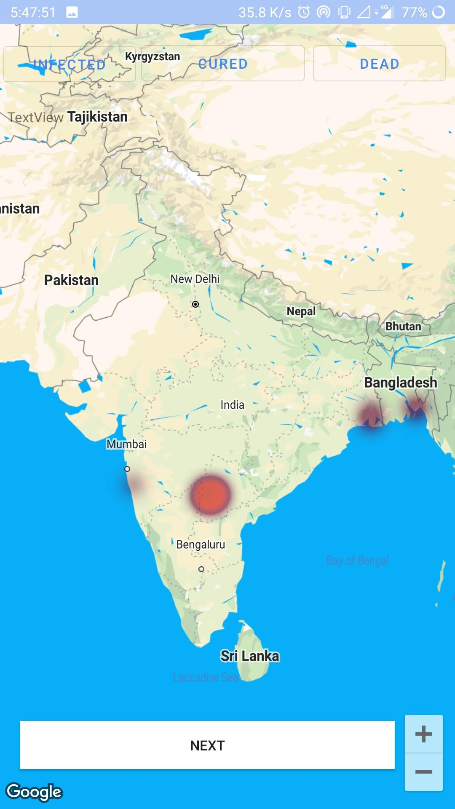
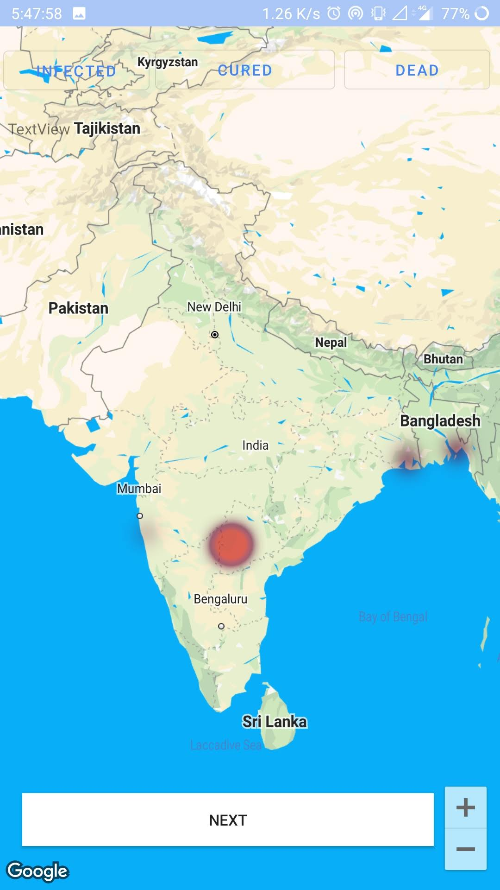
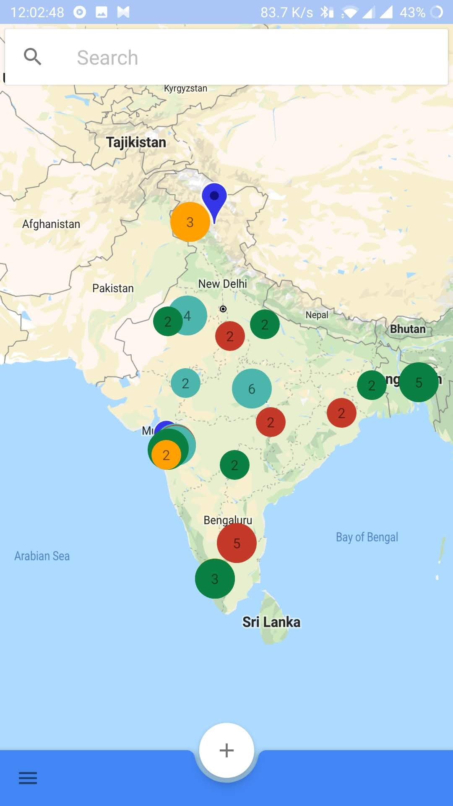
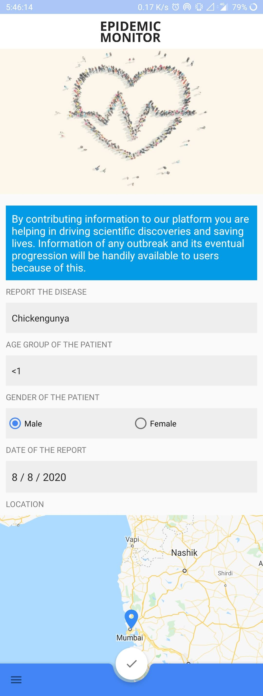
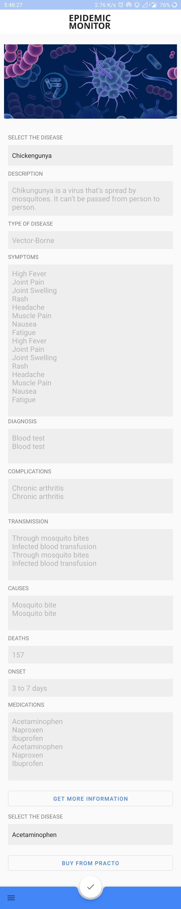

# Epidemic Monitor — Resolve to Prevent Epidemics

## Screenshots

### Homepage

### Prediction of Cases over next 5 weeks

### Visualization of Cases

### Contribute / Crowdsourcing Data

### Diseases Information

## Setup
